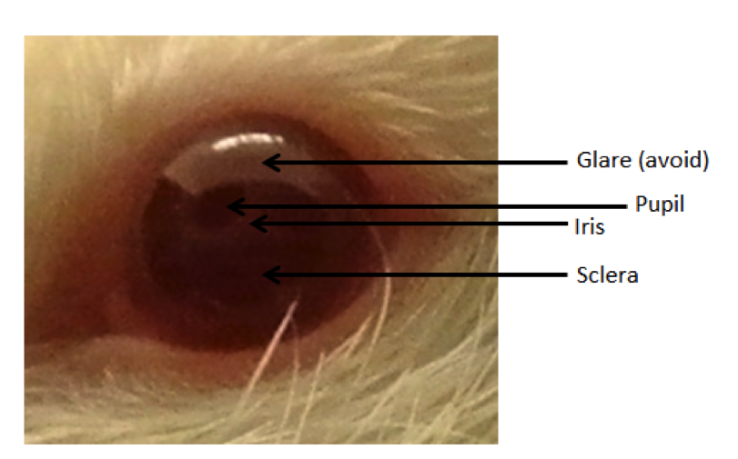
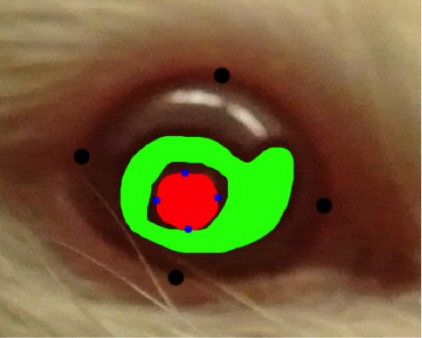
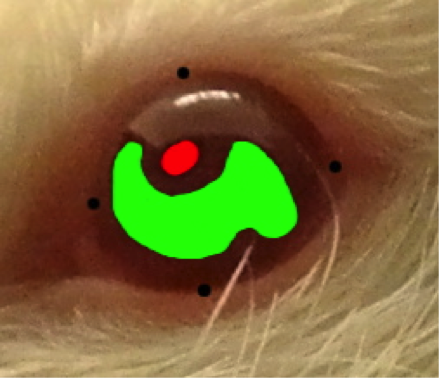

# CataractQuantifier
Quantify the severity and extent of the cataract in a photo of a rat eye.

### Preliminaries
CataractQuantifier provides (nearly identical) versions for Mac and Windows machines (disclaimer: the Windows version is untested). Below is documentation for using CataractQuantifier in either context.

CataractQuantifier is in preparation for publication, along with empirical statistical analysis of its consistency in quantifying rat cataracts. This page will be updated upon publication.

### Taking Photographs
To ensure high-quality, consistent data, all photographs should be taken in the same way. We recommend the following procedure:
- Hold the rat inside a dark box to block extraneous light sources
- Take photos using the same digital camera, with the same settings each time
- Use a fast shutter speed to minimize motion blur
- Use the camera flash to ensure adequate, consistent lighting
- Zoom and focus on the rat's eye, with the same amount of zoom in each photo

### Preparing Photographs for CataractQuantifier
Import all photographs as .png files to a computer, and place them in the same folder. Make a copy of each image with .shaded appended to the end of the filename. The file structure should be as follows, where you can include as many photos as you want in photo_folder:

cataract_quantifier_[mac/windows].py  
photo_folder>  
&nbsp;&nbsp;&nbsp;&nbsp;&nbsp;&nbsp;photo1.png  
&nbsp;&nbsp;&nbsp;&nbsp;&nbsp;&nbsp;photo1.shaded.png  
&nbsp;&nbsp;&nbsp;&nbsp;&nbsp;&nbsp;photo2.png  
&nbsp;&nbsp;&nbsp;&nbsp;&nbsp;&nbsp;photo2.shaded.png  

The next step is to edit each of the photo.shaded.png files to show CataractQuantifier where the lens and sclera are. The relevant portions of an example photo (without a cataract) are illustrated here:  

  

Use your preferred image editor (e.g. Preview for Mac or GIMP for Windows) to add the following shading to each photo.shaded.png file:
- Red: shade in the cataract if there is one, or the lens if there is no cataract
- Green: shade in the sclera (the part of the eye surrounding the lens and the iris)
- Black: mark at least 4 dots or short lines around the border of the eye
- Blue: mark at least 4 dots or short lines around the border of the cataract, if there is one (otherwise do not use blue)
Always avoid highlights when shading, and make sure to use the true shades of red, green, black, and blue. 

Here is an example shaded photo with a cataract:  
  
...and an example shaded photo without a cataract:  
  

### Run CataractQuantifier

The final step is to run CataractQuantifier on your photos. In the command line, navigate to the directory where cataract_quantifier_[mac/windows].py is saved, and run:

```console
$ python cataract_quantifier_[mac/windows].py photo_folder
```

This will produce a file photo_folder.csv in the same directory. This output file contains the results of cataract quantification, including the following values computed for each original input image in photo_folder:
- Mean lens brightness: an indicator of how opaque the lens is
- Mean sclera brightness: a baseline
- Lens/Sclera brightness ratio: our measure of cataract severity
- Cataract area: the surface area covered by cataract, if there is a cataract
- Total eye area: the total surface area of the eye, a baseline
- Cataract/Eye area ratio: our measure of cataract extent

